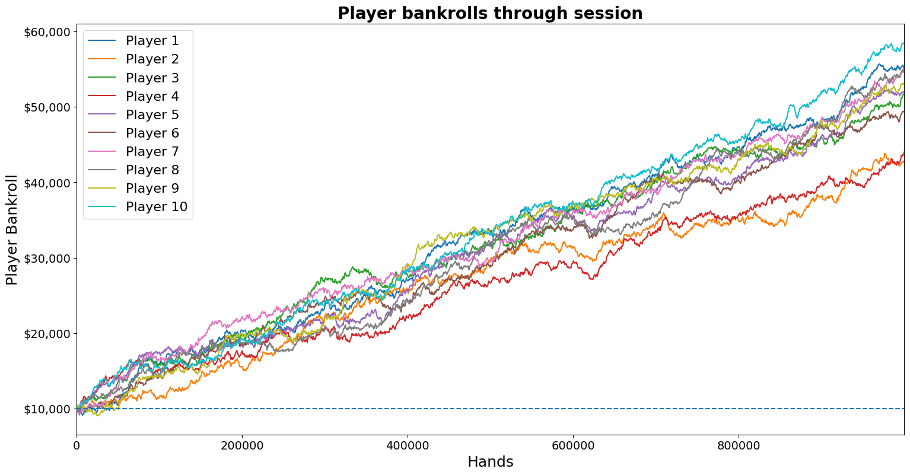
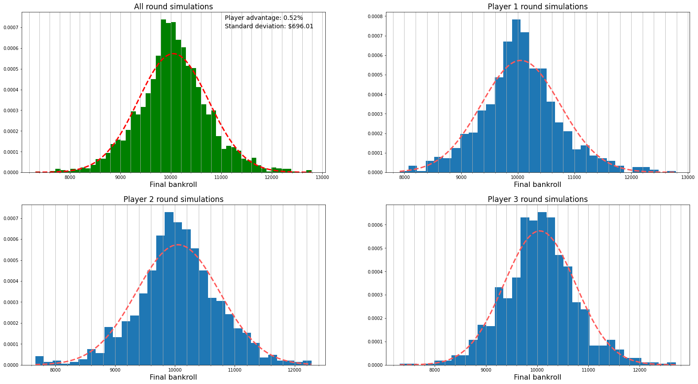

# Blackjack Card Counting Strategy Monte Carlo & Terminal Human/Machine Playable Game

This package allows for Monte Carlo simulation of **Blackjack card counting strategies**. Rulesets, strategies, and simulation parameters are all adjustable to meet user preferences. Default parameters run under a liberal Vegas shoe.

Simulations using this package provide a clear representation of the player's winrate, distribution of play, and drawdown. By adjusting parameters the user can compare rulesets, strategies, player position, bet spreads, and more.

# Getting started
### Prerequisites

* Python 3.7.3+
* [numpy](https://numpy.org/) v1.18.3+
* [scipy](https://www.scipy.org/) v1.4.1+
* [matplotlib](https://matplotlib.org/) v3.2.1+

If package installation is required they may be installed by running:
* `pip install -r requirements.txt`.

### Setup

In terminal (mac) or command prompt (windows) clone the repository with:
* `git clone https://github.com/jackedison/Card_Counting`

Then change directory to the cloned repository:
* `cd Card_Counting`

# Simulate

Once you have cloned to a local repository you are ready to begin running simulations.

There are three modules which the user can run from command line:

1. play_blackjack.py
2. simulate_game.py
3. simulate_games.py

## Play Blackjack in the terminal - play_blackjack.py

The most simple feature is the ability to play blackjack in the terminal. This allows you to test functionality and ruleset responses.

To play run `python3 play_blackjack.py`

By default this will run a blackjack game under a liberal Vegas shoe, that is:
* 6 decks
* 75% penetration
* 3 to 2 blackjack payout
* Dealer stands on soft 17

The ruleset will be printed at the beginning of the game.

### Argparse adjustments
Game parameters and ruleset can be adjusted through command line using argparse.

#### Example 1: Adjust the number of players: -p
Default number of players is 1. 

For example, to adjust the number of players to 3:

`python3 play_blackjack.py -p 3`

#### Example 2: Adjust the penetration: -pe
Default penetration is 0.75 (75% of deck).

For example, to adjust the penetration to 50%:

`python3 play_blackjack.py -pe 0.5`

#### Example 3: Dealer peaks for blackjack: -dp
Default dealer does **not** peak for blackjack.

Note for a boolean you do not need to input a flag after the argument. For example, to enable peak for blackjack:

`python3 play_blackjack.py -dp`

#### All current Argparse parameters

| Parameter                  	| Arg 	| Default 	| Type  	|
|----------------------------	|-----	|---------	|-------	|
| Number of players          	| -p  	| 3       	| int   	|
| Starting bankroll          	| -b  	| 10000    	| int   	|
| Number of rounds           	| -r 	| 100   	| int  	    |
| Number of decks            	| -d  	| 6       	| int   	|
| Deck penetration           	| -pe 	| 0.75    	| float 	|
| Blackjack payout           	| -bp 	| 1.5     	| float 	|
| Win payout                 	| -wp 	| 1       	| float 	|
| Push payout                	| -pp 	| 0       	| float 	|
| Loss payout                	| -lp 	| -1       	| float 	|
| Surrender payout           	| -sp 	| -0.5     	| float 	|
| Dealer stands on hard      	| -sh 	| 17      	| int   	|
| Dealer stands on soft      	| -ss 	| 17      	| int   	|
| Late surrender allowed     	| -ls 	| True    	| bool  	|
| Early surrender allowed    	| -es 	| False   	| bool  	|
| Dealer peaks for blackjack 	| -dp 	| False   	| bool  	|

For example further information and example usage of all parameters type:

 `python play_blackjack.py -h` or `python play_blackjack.py --help`

## Simulate card counting strategies - simulate_blackjack.py

The principal purpose of this package is to enable simulations of millions of hands. This allows for the testing of card counting strategies under specific rulesets, returning player win rates and session distributions.

Either:

* To simulate run one long round of blackjack run `python3 simulate_game.py` or
* To simulate many rounds and view the distribution of play resuls run `python simulate_games.py`

As with the human playable game, Argparse parameters can be passed to adjust the ruleset. All of the above Argparse parameters can also be passed here as well as the below.

#### Additional Argparse parameters for simulations

| Simulation exclusive parameter| Arg 	| Default 	| Type  	|
|----------------------------	|-----	|---------	|-------	|
| Card Counting Strategy        | -s  	| hi_lo     | string   	|
| Custom  Strategy              | -cs  	| None      | list   	|
| Bet Spread          	        | -bs  	| 16    	| int   	|
| Minimum Bet          	        | -mb  	| 1    	    | int   	|
| Number of simulations *       | -sim	| 1000    	| int   	|

*The number of simulations you can run will be limited by your hardware. >1,000,000 should run in >2 minutes on a standard machine.

Included card counting strategies and their parameter names are:
* [hi_lo](https://wizardofodds.com/games/blackjack/card-counting/high-low/)
* [ace_five](https://wizardofodds.com/games/blackjack/ace-five-count/)
* [hi_opt_1](https://www.countingedge.com/card-counting/hi-opt-1/)
* [hi_opt_2](https://www.countingedge.com/card-counting/hi-opt-2/)
* [ko](https://www.onlineblackjackrealmoney.org/card-counting/knock-out)
* [omega_2](https://www.gamingtheodds.com/blackjack/card-counting/systems/omega-2)
* [opp](http://www.blackjackforumonline.com/content/Easy_OPP_Card_Counting_System.htm)
* [red_7](https://www.gamblingonline.com/blackjack/card-counting/)
* [zen](https://www.onlineblackjackrealmoney.org/card-counting/zen-count)

Users may also input their own custom card counting strategy. This strategy should be input as a list of length 13. Each element should indicate the count adjustment for card ranging from Ace to King.

For example, hi_lo as: `python3 simulate_games.py -cs [-1, 1, 1, 1, 1, 1, 0, 0, 0, -1, -1, -1, -1]`

When running simulations the player will play according to Edward Thorp's basic strategy contingent on the ruleset (for doubling, splitting, insuring, etc.)

Betting is scaled at RC or TC > 2 depending on the strategy. Custom strategies will adjust the bet spread at TC > 2 by default.

### Results

Running a simulation of one game will display the following:
* End bankroll by player
* Min bankroll by player during session
* A plot of player bankroll's through the session saved to Figures/

Running a simulation of multiple games will display the following:
* Mean final bankroll by player
* Standard deviation of bankrolls by player
* Overall mean and standard deviation of all hands
* Estimated player advantage*
* A plot of the distribution of final bankrolls of each player saved to Figures/

*Standard practice for player advantage is assumed as mean change in bankroll following a 100 hand game

## Possible extensions

This project started out as a small personal project and is by no means complete. While undertaking this project it became clear that there are almost endless possibilities for extension. Highlighted below are areas I feel would be best to target next.

#### Additional ruleset adjustments
There are a plethora of ruleset alterations casinos offer these days. Additional splitting, surrendering, and doubling down rules would be straightforward to implement where required.

#### Adjust the play decision based on combinatorics
Currently play decisions will be made by following basic blackjack strategy contingent on the ruleset. Combinatorics could be used to calculate the optimal move contingent on the remaining deck.

Additionally, for a more human adoptable approach, play decision could be alterred to the key derivations of whichever strategy is being simulated.

#### Kelly Criterion for bet sizing
The most efficient bet sizing would follow [Kelly Criterion](https://en.wikipedia.org/wiki/Kelly_criterion) based on the win rate of the current hand. Although unreasonable for a human player to implement, if implemented here alongside play decision combinatorics it would offer a benchmark to computer optimal play.

Implementation of play according to the Kelly Criterion would also enable SCORE analysis. (Kelly Criterion to achieve 13.5% risk of ruin)

#### Insurance count
Insurance count, dictating when it is preferential to take insurance, is trivial and has been implemented in the Card_Counter() class. Adapting basic strategy to take advantage of this could be implemented to get additional odds for AP.

#### Custom strategy additions
Options for the user to alter betting preferences and count adjustments (e.g. TC v RC) with their custom strategy could be implemented. (Note: current error here.)

#### Testing
No proper testing/unit tests have been implemented yet as it has been a fairly straightforward project. However, if the project were extended it would be good practice.

If you're interested in extending the code then feel free to get in touch! Current style guidelines used are pylint and pycodestyle (pep8 vscode).

